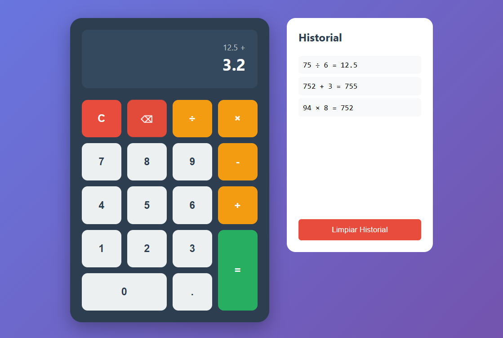

# Calculadora Interactiva

Una calculadora web sencilla hecha con HTML, CSS y JavaScript. Permite realizar operaciones básicas desde la interfaz o con el teclado, y guarda un historial local de cálculos para poder consultarlo después.

## Vista previa

La imagen muestra una representación visual de cómo se ve la aplicación en el navegador.

## Características

- Suma, resta, multiplicación y división.
- Soporte para teclado.
- Historial de operaciones guardado en el navegador.
- Botón para limpiar el historial.
- Diseño responsive para adaptarse a pantallas más estrechas.

## Archivos del proyecto

- `index.html`: estructura principal de la página.
- `calculadora.css`: estilos de la calculadora y del historial.
- `calculadora.js`: lógica de operaciones, teclado e historial.